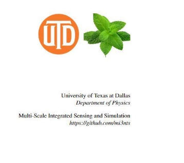
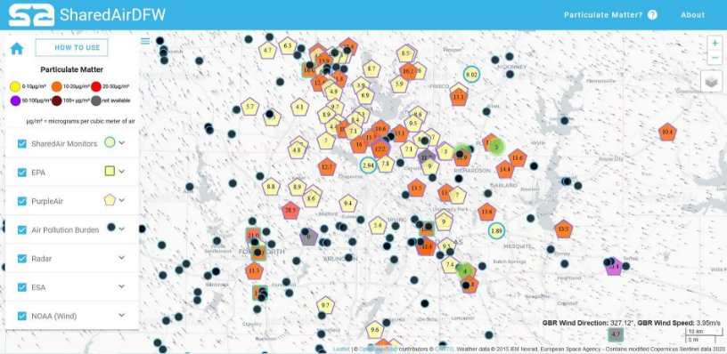
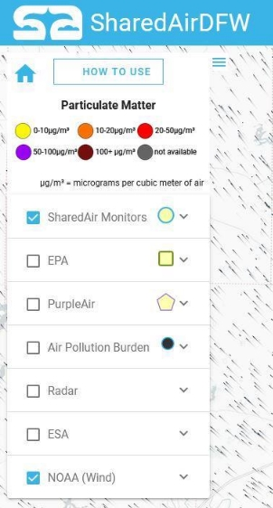

HOW TO ACCESS**MINTS** DATA 

 **MINTS Lab**

MINTS is a multidisciplinary platform developing intelligent sensing systems headquartered at the University of Texas at Dallas (UTD). The platform hosts experts from the UTD department of physics as well as other academic branches within UTD. MINTS data is collected by different types of sentinels such as Ground observation monitors, Aerial survey and Robotic boat etc.

**Access MINTS data:**

Public Portal: <https://www.sharedairdfw.com/>

Comprehensive Grafana Dashboards: [http://mdash.circ.utdallas.edu:3000](http://mdash.circ.utdallas.edu:3000/)

**SharedAirDFW**

Here is a sample view of the SharedAirDFW page. This page is essentially a map for location of sensors and various data measured by them such as PM1, PM2.5, wind vectors etc. 

You can access the SharedAirDFW using <https://www.sharedairdfw.com/>

**HOW TO USE SHOW/HIDE PANEL PARTICULATE MATTER ABOUT**

**HOME ZOOM IN/OUT **

**MAP STYLE**

**SHAREDAIR MONITORS EPA**

**PURPLEAIR**

**AIR POLLUTION BURDEN**

**RADAR ESA**

**NOAA (Wind)**

Top of the Control panel includes HOME, HOW TO USEand SHOW/HIDE PANELbuttons.

Color chart for different concentration range of Particulate Matter.

Series of seven individual panels with each having a check box and a drop-down menu.

- Selecting the check box makes the location of sensors visibleon the map (except NOAA(wind)).
- Selecting the check box of NOAA(wind)displays the wind vectors.
- Clicking on the drop-down menu of each panel shows more details and options available.

**HOME**

This takes you back to the default settings. It will reset the location on the map to display the sensors of SharedAir Monitors and the wind vectors by NOAA.

**SHOW/HIDE PANEL![ref1]**

This button can be used to show or hide the Control panel. You can view the fullmap by hiding the Control panel by clickingon this button.

**ABOUT![ref2]**

This button willopen a new window and willgive a brief description about the SharedAir monitors, funding, the developers of the sensors and the website.

**HOW TOUSE**

The HOW TO USE button pops up a brief instruction window. It provides instruction to see the real time data in each sensor, adding layers to the map and changing the map styles.

**PARTICULATE MATTER![ref3]**

Clickingthis button willpop up a new window with a briefdescription about Particulate Matter.

**ZOOM IN/OUT**

There are two separate buttons:“+” and “-”, which allows you to zoom in and zoom out of the map area respectively.

**MAP STYLE![ref2]**

There are four map styles that can be selected using this button. Once you get the mouse cursor on this icon, it expands with the map options: Carto Positron, Dark mode, Satellite and Street Maps.

**SHAREDAIR MONITORS**

SharedAir monitors are sensors made in the MINTS lab at UTD. Mainly PM2.5 concentration data is available in this site. Under the drop-down menu two options are available for averaging data: hourly average and 30 second average withthe default being 30 second average.

**PURPLEAIR![ref1]**

PurpleAir is a network of low-cost PM sensors that are installed, controlled and maintained by members of the PurpleAir community. Only PM2.5 data averaged every 10 minutes can be obtained from this database.

**RADAR**

Weather data obtained from Radar.

**EPA**

PM2.5 data obtained from the EPA's Air Quality System (AQS)database collected by state, local, tribal and federal air pollution control agencies from thousands of monitors around the nation. Only hourly averaged PM2.5 data is available on this site.

**AIR POLLUTION BURDEN![ref3]**

Yearly estimated PM2.5 concentration where major air pollutionare permitted.

**ESA**

Data of three gases can be monitored: NO2, CO and CH4, as provided by the ESA(European Space Agency).

**NOAA (Wind)![ref2]**

Wind data obtained from NOAA (National Oceanic and Atmospheric Administration’s) database. Selecting this displays wind vectors on the map. Wind direction and speed at the location where the mouse cursor points is displayed on the bottom-right.

[ref1]: Aspose.Words.f063377a-d759-48ec-8296-2f6c39819409.016.png
[ref2]: Aspose.Words.f063377a-d759-48ec-8296-2f6c39819409.017.png
[ref3]: Aspose.Words.f063377a-d759-48ec-8296-2f6c39819409.019.png
